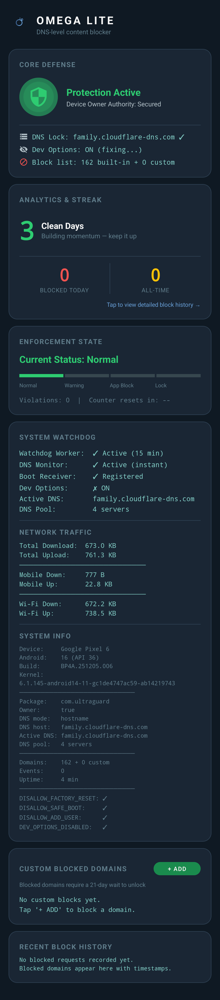

# Omega Lite Android

> **v2.0.0** — Major UI overhaul, multi-DNS failover, push notifications, 21-day domain blocking.

Privacy-respecting DNS-level content blocker for Android (Pixel 6 / Android 10+).

**No screen reading. No kiosk mode. No VPN. No system restriction abuse.**

Uses Android's **Device Owner** API to lock Private DNS to family-friendly DNS servers (Cloudflare Family, CleanBrowsing, AdGuard Family, Quad9), which block adult content at the resolver level. Multi-server failover ensures protection even if a DNS server goes down. Because there is no local VPN, you can freely run any real VPN (NordVPN, Mullvad, etc.) alongside this app.

---

## What's New in v2.0.0

- **Dark UI Redesign** — 6-card dashboard with midnight blue/charcoal theme, emerald green/amber/soft red accents
- **Multi-DNS Failover** — 4 family-friendly DNS servers with automatic health-check and instant fallback
- **Instant DNS Tamper Detection** — ContentObserver-based foreground service detects DNS changes in real-time (not 15-min polling)
- **Developer Options Auto-Disable** — automatically turns off developer options after ADB provisioning
- **Custom Domain Blocking** — add domains to block with a 21-day mandatory lock period before removal
- **Push Notifications** — notifies on blocked access, escalation warnings, and critical events
- **Network Traffic Dashboard** — real-time RX/TX traffic summary via TrafficStats API
- **Block History Activity** — full event history view with timestamps and sources
- **Custom App Icon** — adaptive launcher icon from brand SVG

---

## Screenshot

<p align="center">
  
</p>

---

## Architecture

```
Device Owner (core authority)
        ↓
System Private DNS Lock (Cloudflare Family)
        ↓
App Visibility Control
        ↓
Violation Enforcement (warn → hide → lock)
        ↓
Auto-Heal Watchdog (every 15 min)
        ↓
Local Analytics
```

## Protection Layers

| # | Component | Purpose |
|---|-----------|---------|
| 1 | Device Owner | Full DevicePolicyManager authority |
| 2 | Private DNS Lock | Forces `family.cloudflare-dns.com` system-wide |
| 3 | User Restrictions | Blocks factory reset, safe boot, debugging, add user |
| 4 | App Visibility | Hides known bypass apps (Tor, Opera VPN, etc.) |
| 5 | Violation Escalation | warn → hide offending app → lock device |
| 6 | Watchdog | Re-applies DNS + restrictions every 15 min |
| 7 | Event Logger | Local-only analytics (streak, daily count, history) |

---

## Project Structure

```
app/src/main/java/com/ultraguard/
├── OmegaApp.kt                     # Application entry point
├── MainActivity.kt                  # Dashboard UI (6-card dark theme)
├── BlockHistoryActivity.kt          # Full block history view
├── admin/
│   ├── AdminReceiver.kt            # Device Owner receiver
│   └── PolicyManager.kt            # Central policy orchestrator
├── dns/
│   ├── DnsEnforcer.kt              # Multi-DNS lock with 4-server failover
│   ├── DnsMonitorService.kt        # Instant DNS tamper detection service
│   ├── DomainBlockList.kt          # Built-in block list (100+ domains)
│   └── DomainBlockManager.kt       # Custom domain blocking (21-day lock)
├── appcontrol/
│   └── AppVisibilityManager.kt     # Hide/show apps via DPM
├── violation/
│   ├── ViolationEnforcer.kt        # Escalation ladder + notifications
│   └── NotificationHelper.kt       # Push notification system (3 channels)
├── watchdog/
│   ├── BootReceiver.kt             # Re-apply policies on reboot
│   ├── WatchdogScheduler.kt        # WorkManager scheduler
│   └── WatchdogWorker.kt           # Periodic health check + DNS fallback
└── analytics/
    ├── EventLogger.kt              # Local event logging
    └── NetworkTrafficSummary.kt    # Network traffic stats
```

---

## Requirements

- Android Studio (Ladybug or newer)
- JDK 17+
- Android SDK 34
- A Pixel 6 (or any device running Android 10+)
- USB debugging enabled or Wireless ADB paired

---

## Setup

### 1. Clone & Open

```bash
git clone https://github.com/YOUR_USERNAME/guard-ANDROID.git
```

Open the project in Android Studio. Gradle sync should complete automatically.

### 2. Build & Install

```bash
# From Android Studio:  Build > Make Project  →  Run > Run 'app'
# Or from the command line:
./gradlew assembleDebug
adb install -r app/build/outputs/apk/debug/app-debug.apk
```

> **Pre-built APK:** A debug APK is available in [GitHub Releases](https://github.com/kbvideo6/CrossPlatform-Content-Filter/releases/latest) for sideloading.

### 3. Provision as Device Owner

> **Important:** The device must have **no Google accounts** signed in.
> Remove all accounts from **Settings → Accounts** first.

```bash
adb shell dpm set-device-owner com.ultraguard/.admin.AdminReceiver
```

Expected output:

```
Active admin component set to ComponentInfo{com.ultraguard/com.ultraguard.admin.AdminReceiver}
```

### 4. Verify

Open Omega Lite. The dashboard should show:

- **Protection Active** (green shield glow)
- **Device Owner Authority:** Secured
- **DNS Lock:** family.cloudflare-dns.com ✓
- **Bypass Prevention:** Active ✓
- **Watchdog Worker:** Active (15 min)
- **DNS Monitor:** Active (instant)

---

## How It Works

### Private DNS Lock (Primary Defense)

The Device Owner API locks the system-wide Private DNS to Cloudflare Family:

```
Any App  →  DNS query  →  Android Private DNS  →  family.cloudflare-dns.com
                                                        ↓
                                                  Adult domain?
                                                  YES → NXDOMAIN (blocked)
                                                  NO  → resolve normally
```

- Works across **all** apps, browsers, and even other VPNs
- User **cannot** change Private DNS in Settings (locked by Device Owner)
- Survives reboot (BootReceiver re-applies)
- Watchdog re-verifies every 15 minutes

### Violation Escalation

Non-aggressive escalation ladder:

1. Blocked request → log event silently
2. 3+ attempts in 30 min → warning notification
3. 10+ attempts → hide offending app
4. 20+ attempts → lock device screen
5. Counter resets after 30 minutes of inactivity

### Bypass Difficulty

To remove protection, a user would need to:

1. **Factory reset** (blocked by `DISALLOW_FACTORY_RESET`), OR
2. **Reflash firmware** via bootloader (requires unlocking bootloader + wipes data)

Normal Settings changes, ADB commands, and app uninstall **will not work**.

---

## Privacy

This app does **NOT**:

- Read screen content
- Monitor app usage beyond DNS metadata
- Send any data to external servers
- Lock the user in kiosk mode
- Restrict normal phone functionality

All analytics are stored **locally only** in SharedPreferences.

---

## Removal (Emergency)

```bash
adb shell dpm remove-active-admin com.ultraguard/.admin.AdminReceiver
```

Or factory reset from recovery mode (Vol Down + Power).
